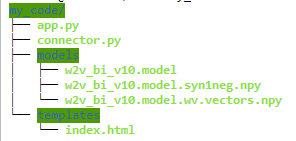
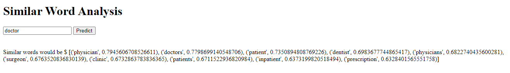

# Production-Deployment-ML-Model
A tutorial on deploying any ML model with Flask + Gunicorn + Nginx.

### Folder structure ###


### The ML model we have ###
Given a text corpus, we run word2vec model on it. After tuning our parameters, we save our word2vec model as -
              `model.save("models/w2v.model")`
Now in any environment, all we need to do is - 
    
    
```python
    model = w2v.load('models/w2v_bi_v10.model')
    word = "doctor"
    prediction = model.wv.most_similar(word)
```
    
 The prediction will contain list of top words with similarity score that are similar to word "doctor".
 
 ### Goal ###
 We need to deploy a simple UI which intakes a word from user and then provides list of words similar to that word, based on our trained word2vec model.
 

## Getting Started ##

### Creating conda environment
<details>
  
```python
conda create -n myapp
conda activate myapp
conda install flask
conda install gensim 

# install lib as per requirements

```
* As we are using gensim, make sure the version is >4.0 with latest python(3.10) 
* To update python packages - 
 <br/> `sudo apt install python3-pip python3-dev build-essential libssl-dev libffi-dev python3-setuptools` 
* To upgrade from a older gensim version in env - 
```unix
conda remove --force gensim
pip install  --upgrade gensim --pre
```
</details>

### Gunicorn installation ###
<details><summary> Run cmd </summary>

`pip install gunicorn` <br/>
Note make sure to run this command while inside env as it can cause compatibility issues.
</details>
  
### Creating our application - app.py ###
<details>

Flask API will receive user input in form of `request.form["word"]`  through UI or API calls, computes the similar words to input based on our saved model and returns it.
In `app.run(debug=True,host='0.0.0.0')` we can change the host as well as port number at which it gets deployed. Follow [this](https://www.codewithharry.com/blogpost/flask-cheatsheet) cheat-sheet for flask commands.
> python app.py
  >> Now our application running successfully on machine_ip:port(by default 5000), go to url http://localhost:5000.

Note: templates/index.html - This folder contains the HTML template to allow user to enter any word and displays the predictions. 
<br/>
Flask server is a development server i.e meant to test locally only. We need to create client-server framework to handle user requests. For this, we need a WSGI and a web server i.e we have - 
* Flask:python framework for web application
* Gunicorn : Application server to handle client request
* Nginx: Web server
</details>

### Connecting app with Gunicorn ###
<details>
  
So far, we have completed our local deployment with Flask. Now will connect/map our flask application and gunicorn server via `connector.py`. <br/>
``` gunicorn --bind :5000 connector:app ```  <br/>
This will run gunicorn server by providing connector file and application module name. Application still runs on same url but now the client request gets handled by the app server - Gunicorn.

<br/>
Before running nginx, we need to setup gunincorn such that it can be started by systemd. This is requirement of nginx. 

- [ ] Edit service file - sudo vi /etc/systemd/system/myapp.service
* Working directory - the root folder path
* Environment - conda env path, can be found via command `conda env list`
* ExecStart - \<path of gunciron in your env\>  --workers 3  --bind unix:myapp.sock -m 007 connector:app
  <br/>  Notice how this gunicorn cmd is different from earlier. Now, we bind it to a unix socket i.e myapp.sock
- [ ]  To start the gunicorn service, we run following commands - 
  ```
          sudo systemctl start myapp
          sudo systemctl enable myapp
          sudo systemctl status myapp
  ```
 - [ ]  The above cmds creates **myapp.sock** in your my_code folder. <br/>
  **NOTE:** change the permission of this file to 777 so that its accessible to nginx. You might need to change the folder permission access as well, because we see in nginx setuo that its start from root folder("/") and then moves to our unix socket **"myapp.sock"**, we need to make sure nginx has permission to do so.
  
  </details>
  
  
### Setting up our web server - nginx ###
<details> <summary> Steps to follow - </summary>
  
- [ ] To install nginx, follow the steps mentioned in [Installing nginx on Ubuntu.](https://www.digitalocean.com/community/tutorials/how-to-install-nginx-on-ubuntu-18-04)
You can install it outside environment as well.
- [ ] sudo usermod ubuntu -g www-data
   - [ ] the user here is ubuntu and group is www-data. Change accordingly.
- [ ] Create nginx configuration file - `sudo vi /etc/nginx/sites-available/myapp`
- [ ] Create a symlink between /etc/nginx/sites-available and /etc/nginx/sites-enabled <br/>
   ```sudo ln -s /etc/nginx/sites-available/myapp /etc/nginx/sites-enabled``` <br/>
  To check if the linkage is successful, run `ls-ln`. If there is already symlink and you need to ovewrite then instead of passing `-s` , pass `-sf` as argument.
- [ ] `sudo nginx -t` Checks any syntax errors in configuration file: nginx.conf
- [ ] Start the application -
       <br/> ```sudo systemctl start nginx```<br/>
      Application will be running at http://localhost:5000
</details>

#### Additional functions
<details> <summary> Error and process logs </summary>
  
 * sudo less /var/log/nginx/error.log: checks the Nginx error logs.
 * sudo less /var/log/nginx/access.log: checks the Nginx access logs.
 * sudo journalctl -u nginx: checks the Nginx process logs.
 * sudo journalctl -u myapp: checks your Flask app’s Gunicorn logs.
  
</details>

#### References 
<details>

 * [Part 1:Deploy Flask App+Anaconda+Gunicorn+Nginx on Ubuntu](https://medium.com/analytics-vidhya/part-1-deploy-flask-app-anaconda-gunicorn-nginx-on-ubuntu-4524014451b)
 * [Part 2](https://medium.com/analytics-vidhya/part-2-deploy-flask-app-anaconda-gunicorn-nginx-on-ubuntu-b12fc4199c59) 
    
</details>  
